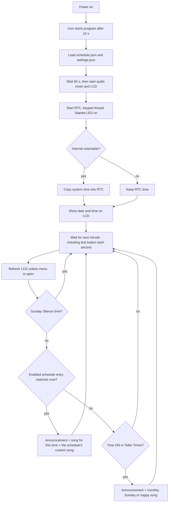

# Time Teller Clock

An automatic talking clock for the church. It runs on a Raspberry Pi connected to speakers. At the times you choose (every 15 minutes by default) it plays a short intro tune and a greeting, then speaks the time, date, month and weekday. After that it plays the church name, a quote, an extra quote and a song. The song can change with the time of day, on Sundays and in chosen months. You can also schedule special songs for chosen times, weekdays and months.

The clock keeps time with a battery-backed RTC (real-time clock) module, so it stays correct without the internet. A 16×2 LCD and a 4-button keypad on the front let you view the time and change settings without a keyboard or monitor.

> **ESP32-C3 version:** the same clock is also available for an ESP32-C3 with an MP3-TF-16P module. It is in [esp32-time-teller-clock/](esp32-time-teller-clock/), with its own [README](esp32-time-teller-clock/README.md) covering wiring and SD card setup. The front-panel behavior described below applies to both versions. The ESP32 version can also be set up from a phone, through its own Wi-Fi hotspot and a settings page.

---

## Contents

1. [Features](#features)
2. [How an announcement works](#how-an-announcement-works)
3. [Hardware](#hardware)
4. [Wiring](#wiring)
5. [Project layout](#project-layout)
6. [Audio files](#audio-files)
7. [Configuration files](#configuration-files)
8. [Using the clock (front panel)](#using-the-clock-front-panel)
9. [Installing on the Raspberry Pi](#installing-on-the-raspberry-pi)
10. [Auto-start and daily reboot](#auto-start-and-daily-reboot)
11. [Testing and development](#testing-and-development)
12. [Troubleshooting](#troubleshooting)
13. [Known issues](#known-issues)
14. [Requirements status / roadmap](#requirements-status--roadmap)
15. [Dev Tools](#dev-tools)

---

## Features

- **Announcements at the times you choose.** In the *Teller Times* menu you pick which quarter-hours have an announcement. By default, every :00, :15, :30 and :45 has one. See [below](#how-an-announcement-works) for what each announcement plays.
- **Church name and extra quotes.** A church name clip plays before the quote and an extra quote plays after it. You can turn each one on or off from the menu.
- **Happy songs by time of day.** You choose which announcements end with a happy song. Songs from `happy_songs_morning/` play before noon and songs from `happy_songs_evening/` play after noon.
- **Sunday songs.** On Sundays, the times you choose play a song from `sunday_songs/` in place of the happy song.
- **Monthly songs.** In the months you select, a song from `monthly_songs/` replaces the happy or Sunday song.
- **Sunday Silence.** On Sunday, nothing plays during a time you set, such as the service.
- **Custom schedules.** In [`schedule.json`](Audio-files/schedule.json) you can set extra play times for chosen weekdays and months. Each one plays a specific song or a random song from a folder.
- **Battery-backed time.** A PCF8563 RTC module keeps the time. When the Pi has internet at startup, the program copies the network-synced system time into the RTC.
- **LCD and keypad menu.** You can set the date and time, turn schedules on or off, and change volumes and other options on the device itself.
- **Separate day and night volumes.** One volume is used from 5 AM to 5 PM and another from 5 PM to 5 AM.
- **Speaker relay control.** Before each clip the program can switch on a relay that powers the speaker or amplifier, and switch it off afterwards.
- **Test button.** Pressing a separate push button plays a test song, so you can check the speakers at any time.
- **Status LEDs.** One LED shows that the program is running and another shows that startup failed.
- **Unattended operation.** The program starts automatically at boot through cron, and the Pi reboots itself every morning at 3:55 AM.

---

## How an announcement works

### Playback sequence

Every announcement plays these clips one after another. Each step waits for the previous clip to finish.

| # | Step | Folder | How the file is picked |
|---|------|--------|------------------------|
| 1 | Rhythm / intro music | `Rythem/` | Random `.mp3` |
| 2 | Greeting ("wishing") | `Wishing/` | Random `.mp3` |
| 3 | Spoken time | `Time/` | By name, e.g. `time-6 15 AM.mp3` |
| 4 | Spoken date | `Date/` | By name, e.g. `date-29.mp3` |
| 5 | Spoken month | `Month/` | By name, e.g. `month-september.mp3` |
| 6 | Spoken weekday | `Day/` | By name, e.g. `day-tuesday.mp3` |
| 7 | Church name (if *Church Name* is ON) | `church_name/` | Random `.mp3` |
| 8 | Quote | `Quotes/` | Random `.mp3` |
| 9 | Extra quote (if *Extra Quotes* is ON) | `extra_quotes/` | Random `.mp3` |
| 10 | Song for this time | See [Which song plays](#which-song-plays) | Random `.mp3`, or none |
| 11 | Custom song (schedules with a `custom_song` only) | `Custom_songs/` or `Custom_songs/<folder>/` | That exact file, or a random `.mp3` from the folder |

If a file picked by name (steps 3–6) is missing, that step is skipped silently. If a folder for a random pick is missing, that step is skipped and `Folder not found, skipping` is written to the log. Time files exist only for quarter-hours, so a custom schedule at a time like 06:05 plays without a spoken time.

### Which song plays

Every announcement, including one started by a schedule, plays the song set in the menu for the current quarter-hour. The first rule that applies wins:

1. **Monthly song** (`monthly_songs/`): the current month is ON in *Monthly Songs*, and a happy song or Sunday song is set for this time.
2. **Sunday song** (`sunday_songs/`): today is Sunday and this time is ON in *Sunday Songs*.
3. **Happy song**: this time is ON in *Happy Songs*. It comes from `happy_songs_morning/` from 12:00 AM to 11:45 AM, and from `happy_songs_evening/` from 12:00 PM to 11:45 PM.
4. **No song**: the announcement ends after the quotes.

If the chosen folder has no `.mp3` files, the next rule is tried. For example, with September ON in *Monthly Songs* but an empty `monthly_songs/` folder, the happy song still plays.

For a schedule with a `custom_song`, the custom song (or a random song from that folder) plays **after** this song. For example, `sunday1` on Sunday at 3:30 PM plays the evening happy song and then a song from `new_folder`. A schedule at a time that is not a quarter-hour, such as 06:05, has no song for its time, so only the custom song plays. To give a schedule only its custom song, turn *Happy Songs* (and *Sunday Songs*) OFF at that time.

Examples:

| Time | Happy Songs | Sunday Songs | Month ON in *Monthly Songs* | Song |
|------|-------------|--------------|-----------------------------|------|
| Monday 9:00 AM | ON | — | No | `happy_songs_morning/` |
| Monday 9:00 PM | ON | — | No | `happy_songs_evening/` |
| Sunday 9:00 AM | ON or OFF | ON | No | `sunday_songs/` |
| Monday 9:00 AM | ON | — | Yes | `monthly_songs/` |
| Monday 10:00 AM | OFF | — | Yes | None |

### When an announcement plays

The main loop wakes up once a minute, at second `00` by the RTC. It then does the following:

1. It refreshes the date and time on the LCD, unless the settings menu is open.
2. If it is Sunday and the time is inside **Sunday Silence**, nothing plays.
3. It checks `schedule.json` for an enabled entry that matches the current time (`HH:MM`, 24-hour), weekday and month. **If one matches, it plays the announcement with that entry's custom song or folder.** If the entry has no `custom_song`, it plays the standard announcement. The first matching entry wins, even at times that are OFF in *Teller Times*.
4. Otherwise, if the current quarter-hour is ON in **Teller Times**, it plays the standard announcement.



The keypad runs on its own thread, so you can use the menu while audio is playing.

### Volume

The program sets the volume before every clip, based on the Pi's system clock:

| Period | Hours | Setting used |
|--------|-------|--------------|
| Morning | 05:00 – 16:59 | `Morning Volume` |
| Evening | 17:00 – 04:59 | `Evening Volume` |

Settings range from 0 to 10. The program maps them to pygame volumes from 0.0 to 1.0.

---

## Hardware

These parts come from the project requirements and the code:

| Part | Purpose |
|------|---------|
| Raspberry Pi (a Pi Zero is planned) | Runs the program |
| Audio output: the 3.5 mm jack, or a **USB-to-AUX adapter** on a Pi Zero (it has no jack) | Carries sound to the speakers |
| Speakers or amplifier plus an AUX cable | Plays the sound |
| Relay module *(optional)* | Switches speaker or amplifier power from GPIO 23 |
| 16×2 character LCD with a **PCF8574 I²C backpack** (address `0x27`) | Shows the time and the menu |
| **PCF8563** RTC module with a coin-cell battery (I²C address `0x51`) | Keeps time without power or internet |
| 2×2 button matrix (4 push buttons) | LEFT / RIGHT / BACK / SET |
| 1 push button | Plays the test song |
| 2 LEDs + resistors | Show "Started" and "Failed" status |
| Power adapter (a battery backup is planned) | Powers the Pi |
| Micro-USB OTG adapter and mini-HDMI adapter (for a Pi Zero) | Setup and maintenance |
| 3D-printed case | Enclosure |

---

## Wiring

All pin numbers in the code use **BCM** numbering. The physical header pins are listed here for convenience.

> The inline comments next to the pin definitions in [time-teller-clock-program.py](time-teller-clock-program.py#L22-L25) mention "GPIO17 (pin 11)". Those comments are out of date. The table below matches the code.

| Function | BCM GPIO | Physical pin | Direction | Notes |
|----------|----------|--------------|-----------|-------|
| I²C SDA (LCD + RTC) | 2 | 3 | — | Shared I²C bus 1 |
| I²C SCL (LCD + RTC) | 3 | 5 | — | Shared I²C bus 1 |
| "Started" LED | 14 | 8 | Output | HIGH once the program is running |
| "Failed" LED | 15 | 10 | Output | HIGH if RTC setup fails |
| Test-song button | 18 | 12 | Input, pull-up | Connect the button between this pin and GND |
| Speaker relay | 23 | 16 | Output | HIGH while a clip plays (when *Speaker Output* is ON) |
| Keypad row 1 | 4 | 7 | Output | |
| Keypad row 2 | 17 | 11 | Output | |
| Keypad column 1 | 27 | 13 | Input, pull-up | |
| Keypad column 2 | 22 | 15 | Input, pull-up | |

GPIO 14 and 15 are also the Pi's UART (serial) pins. If the serial console is enabled, turn it off (`raspi-config` → *Interface Options* → *Serial Port*) so it does not interfere with the LEDs.

### Keypad matrix

The program pulls each row LOW in turn and reads the columns. Each button connects one row to one column.

|                     | Column BCM 27 (pin 13) | Column BCM 22 (pin 15) |
|---------------------|------------------------|------------------------|
| **Row BCM 4 (pin 7)**   | LEFT                   | RIGHT                  |
| **Row BCM 17 (pin 11)** | BACK                   | SET                    |

To test the keypad on its own, run [`Dev Tools/keypad_test.py`](Dev%20Tools/keypad_test.py). It prints `1`/`2`/`3`/`4`, which map to LEFT/RIGHT/BACK/SET.

---

## Project layout

```
time-teller-clock/
├── time-teller-clock-program.py      # Main program (runs on the Pi)
├── settings.json                     # Created automatically when settings are saved (not in Git)
├── Audio-files/
│   ├── schedule.json                 # Custom play schedules
│   ├── Rythem/                       # Intro music (random)
│   ├── Wishing/                      # Greeting clips (random)
│   ├── Time/                         # 96 files: time-<h> <mm> <AM|PM>.mp3
│   ├── Date/                         # 31 files: date-<d>.mp3
│   ├── Month/                        # 12 files: month-<name>.mp3
│   ├── Day/                          # 7 files:  day-<name>.mp3
│   ├── church_name/                  # Church name clips, before the quote (random)
│   ├── Quotes/                       # Quotes (random)
│   ├── extra_quotes/                 # Extra quotes, after the quote (random)
│   ├── happy_songs_morning/          # Happy songs for 12 AM - 12 PM (random)
│   ├── happy_songs_evening/          # Happy songs for 12 PM - 12 AM (random)
│   ├── sunday_songs/                 # Sunday songs (random)
│   ├── monthly_songs/                # Monthly songs (random)
│   └── Custom_songs/                 # Songs for schedules + Testsong.mp3
│       └── <folder>/                 # Optional sub-folders for "random from folder" schedules
├── Audio-files-acc-format.rar        # Original recordings in AAC format (before MP3 conversion)
├── esp32-time-teller-clock/          # ESP32-C3 + MP3-TF-16P version (Arduino sketch + SD card script)
├── Dev Tools/                        # Hardware test scripts, TTS generators, setup notes
├── help.txt                          # How to convert .aac → .mp3 with ffmpeg
├── project-works.txt                 # Feature to-do list
└── Schedule-time-song-requirement.txt# Original requirements and hardware list
```

The program expects this layout at a **fixed path**, set in [time-teller-clock-program.py:59](time-teller-clock-program.py#L59):

```python
BASE_DIR = "/home/pi/time-teller-clock/Audio-files"
```

`settings.json` is stored one level above that, at `/home/pi/time-teller-clock/settings.json`.

Folders that start out empty contain a `.gitkeep` placeholder file so that Git keeps them. Put your `.mp3` files in them; the placeholder is ignored because only `.mp3` files are played. An empty folder is simply skipped.

> **Upgrading from the earlier version:** the old `happy_songs/` folder is no longer used. Move its songs into `happy_songs_morning/` and `happy_songs_evening/`.

---

## Audio files

### Naming rules

The program builds the time, date, month and day filenames from the current RTC time, so these files must be named exactly as shown:

| Folder | Pattern | Examples | Count |
|--------|---------|----------|-------|
| `Time/` | `time-<hour 1-12, no leading zero> <minute 00/15/30/45> <AM\|PM>.mp3` | `time-6 00 AM.mp3`, `time-12 45 PM.mp3` | 96 |
| `Date/` | `date-<day 1-31, no leading zero>.mp3` | `date-1.mp3`, `date-29.mp3` | 31 |
| `Month/` | `month-<full month name, lowercase>.mp3` | `month-january.mp3` | 12 |
| `Day/` | `day-<full weekday name, lowercase>.mp3` | `day-sunday.mp3` | 7 |

For the folders that play a random file (`Rythem`, `Wishing`, `church_name`, `Quotes`, `extra_quotes`, `happy_songs_morning`, `happy_songs_evening`, `sunday_songs`, `monthly_songs` and custom sub-folders), any filename works. The extension must be lowercase `.mp3`, because the check is case-sensitive and files ending in `.MP3` are ignored.

`Custom_songs/Testsong.mp3` is the file played by the test button.

Keep custom song and folder names **16 characters or less**, because they are shown on the LCD while they play.

### Making audio files

- **Recorded audio (AAC to MP3).** The original recordings are in `Audio-files-acc-format.rar`. To convert them, use ffmpeg as described in [help.txt](help.txt):
  ```bat
  :: Windows cmd, inside the folder of .aac files
  for %f in (*.aac) do ffmpeg -i "%f" "%~nf.mp3"
  del *.aac
  ```
- **Text-to-speech.** The scripts in [`Dev Tools/scrpit to generate time speech/`](Dev%20Tools/scrpit%20to%20generate%20time%20speech/) use [gTTS](https://pypi.org/project/gTTS/) to create speech clips in English (`lang='en'`) or Tamil (`lang='ta'`). `time_audio_zip.py` creates all 96 quarter-hour clips as `time_audio_files/<h> <mm> <AM|PM>.mp3`. **Add the `time-` prefix** to each name before copying the files into `Time/`.

The requirements document gives these target clip lengths: rhythm 10 s–1 min, time/date/day about 20 s each, quotes about 30 s, and custom songs 5–30 min.

---

## Configuration files

### `Audio-files/schedule.json` — custom play times

This file is a list of schedule entries:

```json
[
  {
    "schedule_name": "mon_tue_mornings",
    "time": "06:05",
    "days": ["monday", "tuesday"],
    "months": ["june", "july"],
    "custom_song": "GokulHari.mp3",
    "enabled": true
  },
  {
    "schedule_name": "sunday1",
    "time": "15:30",
    "days": ["sunday"],
    "months": ["all"],
    "custom_song": "new_folder",
    "enabled": true
  }
]
```

| Field | Required | Meaning |
|-------|----------|---------|
| `schedule_name` | yes | Unique name shown in the LCD *Schedule Songs* menu (the first 14 characters are shown) |
| `time` | yes | `"HH:MM"` in **24-hour** format with leading zeros, e.g. `"06:05"` or `"15:30"` |
| `days` | yes | Lowercase weekday names, or `["all"]` |
| `months` | yes | Lowercase month names, or `["all"]` |
| `custom_song` | no | A filename ending in `.mp3` plays that file from `Custom_songs/`. Any other value is treated as a **sub-folder** of `Custom_songs/`, and a random `.mp3` from it plays. If you leave it out, the standard announcement plays at that time. |
| `enabled` | yes | `true` or `false`. You can toggle it from the LCD. |

Rules:

- Only the **first** enabled entry that matches is used.
- A matching schedule replaces the normal announcement for that minute. The announcement plays once, followed by the song set for that time (if any) and then the custom song.
- Schedules play even at times that are OFF in *Teller Times*, but not during *Sunday Silence*. The song set for that time still plays at a schedule, even if *Teller Times* is OFF there.
- A happy song plus a long custom song can take many minutes. Any announcement time that passes while audio is playing is skipped.
- An entry **without** `custom_song` plays the standard announcement at its time, with the song set for that time in the menu ([Which song plays](#which-song-plays)). Songs are set per quarter-hour, so at a time like 06:05 there is no song.
- Toggling a schedule from the LCD rewrites this file right away.

### `settings.json` — device settings

The program creates this file the first time a setting is saved from the menu. If it is missing, the defaults are used. When a key is missing from the file, the default value is added. Example:

```json
{
    "teller_times": ["06:00", "09:00", "12:00", "18:00", "21:00"],
    "happy_song_times": ["09:00", "21:00"],
    "sunday_song_times": ["09:00"],
    "sunday_silence": {"enabled": true, "start": "09:00", "end": "11:00"},
    "monthly_songs": {
        "January": false, "February": false, "March": false, "April": false,
        "May": false, "June": false, "July": false, "August": false,
        "September": false, "October": false, "November": false, "December": true
    },
    "church_name": true,
    "extra_quotes": true,
    "speaker_output": true,
    "morning_volume": 5,
    "evening_volume": 5
}
```

| Key | Menu item | Meaning | Default |
|-----|-----------|---------|---------|
| `teller_times` | Teller Times | Times when the time teller runs | Every 15 minutes |
| `happy_song_times` | Happy Songs | Times whose announcement ends with a happy song | Every 15 minutes |
| `sunday_song_times` | Sunday Songs | Times whose Sunday announcement ends with a Sunday song | None |
| `sunday_silence` | Sunday Silence | ON/OFF, start and end of the Sunday time with nothing played. The end time is not included. | OFF, 09:00–11:00 |
| `monthly_songs` | Monthly Songs | Months that play monthly songs | All `false` |
| `church_name` | Church Name | Play `church_name/` before the quote | `true` |
| `extra_quotes` | Extra Quotes | Play `extra_quotes/` after the quote | `true` |
| `speaker_output` | Speaker Output | Switch the relay on GPIO 23 while audio plays | `true` |
| `morning_volume`, `evening_volume` | Morning / Evening Volume | 0–10 | `5` |

All times are `"HH:MM"` in 24-hour format and must be quarter-hours (`:00`, `:15`, `:30` or `:45`), because those are the only times with a spoken-time recording.

**Upgrading from the earlier version:** the speaker and volume values in an old `settings.json` are kept. The old `Monthly Songs`, `Sunday Songs`, `Happy Song` and `Schedule Songs` entries are ignored and removed the next time settings are saved. Schedules are still turned on and off in `schedule.json`.

---

## Using the clock (front panel)

### Home screen

```
┌────────────────┐
│29-Sep-2026     │
│06:15:00 AM     │
└────────────────┘
```

The screen refreshes once a minute, so the seconds always show `00`. While a custom song plays, the screen shows `playing...` and the song or folder name.

### Buttons

| Button | On the home screen | In a menu |
|--------|--------------------|-----------|
| **SET** | **Hold for more than 1 second** to open the settings menu | Select, toggle or change a value |
| **RIGHT** | — | Next item / increase |
| **LEFT** | — | Previous item / decrease |
| **BACK** | — | Save and go back |
| **Test button** | Press and hold for about 1 second to play `Testsong.mp3` | Also works while the menu is open |

The test button is checked once a second, and only while no audio is playing.

### Settings menu

Hold **SET** to open the menu. Use **LEFT** and **RIGHT** to move through these items (the list wraps around):

| Menu item | Line 2 shows | What SET does | Default |
|-----------|--------------|---------------|---------|
| **Date & Time** | `HH:MM dd-mm` | Opens the date and time editor | — |
| **Teller Times** | `Tap Set to Open` | Opens a [time list](#time-lists-teller-times-happy-songs-sunday-songs): when the time teller runs | Every 15 minutes |
| **Happy Songs** | `Tap Set to Open` | Opens a time list: which announcements end with a happy song | Every 15 minutes |
| **Sunday Songs** | `Tap Set to Open` | Opens a time list: which Sunday announcements end with a Sunday song | None |
| **Sunday Silence** | `Tap Set to Open` | Opens [Sunday Silence](#sunday-silence): ON/OFF, start and end time | OFF, 9:00–11:00 AM |
| **Monthly Songs** | `Tap Set to Open` | Opens the list of months, each ON or OFF | All OFF |
| **Church Name** | `Status: ON/OFF` | Turns the church name clip ON or OFF | ON |
| **Extra Quotes** | `Status: ON/OFF` | Turns the extra quote ON or OFF | ON |
| **Schedule Songs** | `Tap Set to Open` | Opens the list of schedules, each ON or OFF | From `schedule.json` |
| **Speaker Output** | `Status: ON/OFF` | Turns relay control on GPIO 23 ON or OFF | ON |
| **Morning Volume** | `Value: n` | Adds 1 (after 10 it goes back to 0) | 5 |
| **Evening Volume** | `Value: n` | Adds 1 (after 10 it goes back to 0) | 5 |

Press **BACK** to save everything to `settings.json`, apply the Speaker Output setting, show `Settings Saved`, and return to the home screen. The sub-menus also save when you leave them with BACK.

### Time lists: Teller Times, Happy Songs, Sunday Songs

```
┌────────────────┐
│> 09:00 AM      │
│Status: ON      │
└────────────────┘
```

The list has one entry for each quarter-hour, from 12:00 AM to 11:45 PM, and opens at the current time.

- Press **LEFT** or **RIGHT** to move 15 minutes. Hold the button for 2 seconds to move an hour at a time.
- Press **SET** to turn the shown time ON or OFF.
- Press **BACK** to save and return to the menu (`Setting Saved`).
- Three shortcuts sit before 12:00 AM. Press LEFT from 12:00 AM to reach them:
  - **All ON**: every quarter-hour ON.
  - **All OFF**: every quarter-hour OFF.
  - **Every hour**: only the :00 times ON.

  Press **SET twice** to apply a shortcut. The first press shows `Set again = OK`; moving away cancels it.
- A song only plays when the time teller runs. In *Happy Songs* and *Sunday Songs*, `ON (Teller OFF)` means a song is set for that time but *Teller Times* is OFF there, so it only plays if a schedule runs at that time.

For example, to announce every hour from 6 AM to 9 PM: in *Teller Times*, apply **Every hour**, then turn OFF 10:00 PM through 5:00 AM.

### Sunday Silence

```
┌────────────────┐
│> Start time    │
│09:00 AM  +/-   │
└────────────────┘
```

On Sundays, nothing plays from the start time up to the end time: no announcements and no schedules. The end time itself is not silenced. With 9:00–11:00 AM, the 9:00 to 10:45 announcements are skipped and 11:00 plays. The test button still works.

- The menu has three items: **Silence** (ON/OFF), **Start time** and **End time**. Press **LEFT** or **RIGHT** to move between them.
- On *Silence*, press **SET** to turn it ON or OFF.
- On a time, press **SET** to start changing it (`+/-` appears). Then press **LEFT** or **RIGHT** to change it by 15 minutes, or hold to move an hour at a time. Press **SET** or **BACK** when done.
- Press **BACK** to save and return to the menu.

If the end time is earlier than the start time, the silence crosses midnight. For example, 10:00 PM to 2:00 AM silences Sunday from midnight to 2 AM and from 10 PM to midnight.

### Date & Time editor

```
┌────────────────┐
│29-09-2026      │   day - month - year
│06:15:00        │   hour : minute : second (24-hour)
└────────────────┘
```

1. A blinking cursor marks the selected field. Press **LEFT** or **RIGHT** to move between day, month, year, hour, minute and second.
2. Press **SET** to start changing the selected field. Then press **RIGHT** to increase it or **LEFT** to decrease it.
3. Press **SET** or **BACK** when you have finished with that field.
4. Press **BACK** again to **write the new time to the RTC**. The screen shows `RTC Updated!` and you return to the menu.

Notes:

- The clock does not keep running while you edit. The time you enter is saved exactly as shown when you press BACK.
- Leaving the editor always saves; there is no cancel. Even if you change nothing, the RTC is set to the time captured when the editor opened, so the clock falls behind by however long you spent in the editor.
- Every field wraps around. For example, the day goes from 30 back to 1 in a 30-day month, and the month goes from 12 back to 1. If you change the month or year and the day no longer exists (such as 31 in April, or 29 February in a non-leap year), the day is moved to the last valid day.
- If the Pi has internet at the next startup, the RTC is overwritten with the network time.

### Monthly Songs and Schedule Songs sub-menus

```
┌────────────────┐
│> sunday1       │
│Status: ON      │
└────────────────┘
```

- Press **LEFT** or **RIGHT** to move between months or schedules, and **SET** to toggle ON/OFF.
- Press **BACK** to save and return to the main menu (`Setting Saved`).
- *Monthly Songs* opens at the current month. In a month that is ON, a song from `monthly_songs/` plays in place of the happy or Sunday song, only at times where one of those is set.

### Status LEDs

| LED | Meaning |
|-----|---------|
| Started (GPIO 14) ON | Startup finished and the clock is running |
| Failed (GPIO 15) ON | RTC setup failed |
| Both OFF | Still starting (the first ~70 s after boot), or the program has stopped |

---

## Installing on the Raspberry Pi

1. **Enable I²C.** Run `sudo raspi-config` and go to *Interface Options* → *I2C* → *Enable*, then reboot.
2. **Check the I²C devices:**
   ```bash
   sudo apt install -y i2c-tools
   i2cdetect -y 1        # expect 27 (LCD) and 51 (RTC)
   ```
   If your LCD shows up at another address (often `3f`), change `0x27` in [time-teller-clock-program.py:199](time-teller-clock-program.py#L199).
3. **Install the Python packages:**
   ```bash
   sudo apt install -y python3-pip python3-pygame python3-rpi.gpio python3-smbus
   pip3 install RPLCD adafruit-blinka adafruit-circuitpython-pcf8563
   ```
   On Raspberry Pi OS Bookworm and later, pip refuses system-wide installs. Either add `--break-system-packages` or use a virtual environment. If you use a virtual environment, point the cron line at its `python3`.
4. **Copy the project** so the paths match `BASE_DIR`:
   ```bash
   cd /home/pi
   git clone https://github.com/gokulhari012/time-teller-clock.git
   ```
   Then put your audio into the folders as described in [Audio files](#audio-files).
5. **Choose the audio output.** Pick the headphone jack or USB audio in `raspi-config` → *System Options* → *Audio*, or with `alsamixer`. If pygame produces no sound, try uncommenting `os.environ["SDL_AUDIODRIVER"] = "alsa"` at [line 169](time-teller-clock-program.py#L169).
6. **Run it once by hand** to check that everything works:
   ```bash
   python3 /home/pi/time-teller-clock/time-teller-clock-program.py
   ```
   The program waits **60 seconds** before starting the audio and LCD. This gives the hardware and sound system time to come up after boot. Press `Ctrl+C` to stop it; the LCD is cleared, the LEDs turn off and the GPIO pins are released.

---

## Auto-start and daily reboot

These steps come from [`Dev Tools/requirements and help doc.txt`](Dev%20Tools/requirements%20and%20help%20doc.txt).

```bash
chmod +x /home/pi/time-teller-clock/time-teller-clock-program.py
chown pi:pi /home/pi/time-teller-clock/time-teller-clock-program.py
crontab -e
```

Add these lines:

```cron
# Start the clock 10 s after boot (I2C devices need a moment); log output to startup.log
@reboot sleep 10 && /usr/bin/python3 /home/pi/time-teller-clock/time-teller-clock-program.py >> /home/pi/startup.log 2>&1 &

# Reboot every day at 03:55 AM
55 3 * * * sudo reboot
```

- To see the logs, run `cat /home/pi/startup.log`.
- From power-on to the first screen takes about **70 seconds** (10 s cron delay + 60 s program delay).
- The daily reboot also restarts the program if it has crashed. Cron does not restart it on its own.

---

## Testing and development

### Test at a fake time

Steps from the Dev Tools notes:

```bash
timedatectl                          # check "NTP service: active"
sudo timedatectl set-ntp false       # stop automatic time sync
sudo date -s "2025-07-05 19:44:50"   # set a test time
python3 time-teller-clock-program.py
sudo timedatectl set-ntp true        # restore when done
```

When the program starts with internet available, it copies the **system** time into the RTC. A fake system time therefore also ends up in the RTC. After testing, turn NTP back on and restart the program (or reboot) so the RTC gets the correct time again.

### Play an announcement every minute

In the main loop ([lines 1010–1026](time-teller-clock-program.py#L1010-L1026)), the comments show a development mode. Replace `elif is_teller_time(now):` with the commented `else:` to hear an announcement every minute. Comment out `wait_for_next_minute()` to skip the wait.

### Testing on Windows

The filename helpers (`get_time_filename`, `get_date_filename`) handle the Windows `strftime` format (`%#I`) as well as the Linux one (`%-I`). The rest of the program needs Raspberry Pi hardware (`RPi.GPIO`, I²C, LCD, RTC), so it will not run on a PC as it is.

### Hardware test scripts

| Script | Tests |
|--------|-------|
| [`Dev Tools/keypad_test.py`](Dev%20Tools/keypad_test.py) | Keypad matrix: prints which button is pressed |
| [`Dev Tools/temp files/lcd_program.py`](Dev%20Tools/temp%20files/lcd_program.py) | LCD: shows a live clock from the system time |
| [`Dev Tools/temp files/rtc_program.py`](Dev%20Tools/temp%20files/rtc_program.py) | RTC: prints the RTC time every second |
| [`Dev Tools/temp files/wifi_check_program.py`](Dev%20Tools/temp%20files/wifi_check_program.py) | Internet check used at startup |

---

## Troubleshooting

| Symptom | Things to check |
|---------|-----------------|
| **LCD is blank after boot** | Wait about 70 seconds. Run `i2cdetect -y 1` and look for `27`. Adjust the contrast potentiometer on the LCD backpack. Check `startup.log`. |
| **No sound** | Check the audio output (`raspi-config` / `alsamixer`) and whether the USB audio adapter is the default device. Make sure Morning or Evening Volume is not 0. If *Speaker Output* is ON, check the relay wiring on GPIO 23. Check that the files exist and are named exactly as in [Naming rules](#naming-rules). Try `SDL_AUDIODRIVER=alsa`. |
| **Time not spoken, but music plays** | The time file is missing or misnamed, or the schedule is at a time other than :00/:15/:30/:45. |
| **No announcement at a time you expected** | Check that the time is ON in *Teller Times*. On Sundays, also check *Sunday Silence*. |
| **Announcement plays but no song after it** | Check that the time is ON in *Happy Songs* (or *Sunday Songs* on Sunday), and that the matching folder has `.mp3` files. A song set for a time that is OFF in *Teller Times* shows `ON (Teller OFF)` and only plays if a schedule runs at that time. |
| **Monthly song plays instead of the happy song** | That month is ON in *Monthly Songs*. |
| **A folder schedule plays no song** | Check that the folder named in `custom_song` exists inside `Custom_songs/` and contains `.mp3` files. Look for `Folder not found, skipping` in `startup.log`. |
| **Wrong time** | Set it in the *Date & Time* menu, or connect to the internet and reboot. If the time is lost after a power cut, replace the RTC coin cell. |
| **Keypad stops responding** | The keypad thread probably stopped with an error. Check `startup.log`, then reboot or wait for the 3:55 AM reboot. |
| **Program stopped (Started LED off)** | Read `/home/pi/startup.log` for the error. The program stops on any unexpected error (see [Known issues](#known-issues)). |
| **Want to run it by hand while cron started it** | Stop the running copy first: `pkill -f time-teller-clock-program.py` |

---

## Known issues

These come from reading the current code. The line numbers refer to [time-teller-clock-program.py](time-teller-clock-program.py).

| # | Issue | Effect | Suggested fix |
|---|-------|--------|---------------|
| 1 | Only `KeyboardInterrupt` is caught in the main block | Any other error stops the program until the next reboot. | Run it as a `systemd` service with `Restart=always`, or catch errors in the loop |
| 2 | `PCF8563(i2c)` raises an exception when the RTC is missing | The "Failed" LED branch is never reached. The program exits instead. | Wrap `init_RTC()` in `try/except` |
| 3 | Volume uses `datetime.now()` (the system clock), not the RTC | Without internet, the morning/evening volume switch can happen at the wrong time. | Pass the RTC time into `auto_set_volume` |
| 4 | The RTC is synced whenever the internet is reachable, without checking that NTP has synced | A wrong system time could be written to the RTC. | Check `timedatectl show -p NTPSynchronized` first |

---

## Requirements status / roadmap

This compares the items in [project-works.txt](project-works.txt) and [Schedule-time-song-requirement.txt](Schedule-time-song-requirement.txt) with the current code:

| Requirement | Status |
|-------------|--------|
| Set time and date from the display and keypad | ✅ Done |
| Play rhythm → wishing → time → date → month → day → quote | ✅ Done |
| Play wishing clip after the rhythm | ✅ Done (random file from `Wishing/`) |
| Custom schedules by time, weekday and month | ✅ Done (edit the JSON; enable or disable from the LCD) |
| Custom play from a folder (random song) | ✅ Done |
| Choose the announcement times from the display | ✅ Done (*Teller Times*) |
| Church name before the quote, extra quote after it, each with ON/OFF | ✅ Done |
| Happy songs after the quotes, chosen per time, with morning and evening folders | ✅ Done (*Happy Songs*) |
| Sunday songs at chosen times, in place of the happy song | ✅ Done (*Sunday Songs*; random song from `sunday_songs/`) |
| No announcements during a chosen time on Sunday | ✅ Done (*Sunday Silence*) |
| Monthly songs in selected months, in place of happy and Sunday songs | ✅ Done (*Monthly Songs*) |
| Speaker relay on GPIO | ✅ Relay switches around each clip |
| Speaker relay on/off **time schedule** | ❌ Not started |
| Separate morning and night volume | ✅ Done; the 5 AM / 5 PM switch times are fixed in code |
| Configurable morning and night from/to times | ❌ Not started |
| Fade out the rhythm; make the time announcement louder | ❌ Not started (fade code is commented out in `play_audio`) |
| Custom schedule: song count, start/stop, fade in/out | ❌ Not started |
| Add, edit and delete schedules from the display | ❌ Only enable/disable; edit the JSON for the rest |
| Hardware: case, battery, CMOS/RTC battery check | 🔧 Hardware task |

---

## Dev Tools

| Path | Contents |
|------|----------|
| [`Dev Tools/requirements and help doc.txt`](Dev%20Tools/requirements%20and%20help%20doc.txt) | Setting a fake system time, cron auto-start and daily reboot |
| [`Dev Tools/keypad_test.py`](Dev%20Tools/keypad_test.py) | Stand-alone 2×2 keypad test |
| [`Dev Tools/scrpit to generate time speech/`](Dev%20Tools/scrpit%20to%20generate%20time%20speech/) | gTTS scripts: `time_audio_zip.py` (all 96 time clips), English and Tamil samples, `test.py` |
| [`Dev Tools/temp files/`](Dev%20Tools/temp%20files/) | Early stand-alone versions of the LCD, RTC and Wi-Fi check code, plus a scratch file (`temp.py`) |
| [help.txt](help.txt) | Converting AAC to MP3 with ffmpeg |
